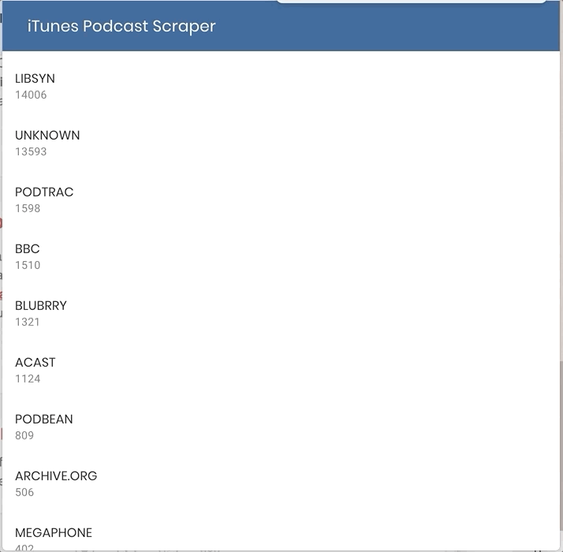

# itunes-scraper

## Podcast data scraper based on iTunes library data

NOTES:

**1. This project requires a PostgreSQL database. Credentials need to be stored in a `db/credentials.json` file (see example): `{ "user": "<username>", "host": "<hostname>", "database": "<db_name>", "password": "<your_supersecret_password>" }`
2. The DB is currently incomplete since the first run is taking time to complete**

### Currently served endpoints

1. `/analyzer`
2. `/top10`

### Analyzer

How does the analysis process work:

1. The Database is queried for old records to update;
2. Selected records are split into 100 elements batches;
3. Each batch is analysed waterfall due to limited computational resources. For each batch, elements are analysed concurrently. The analysis process for each element is composed of these steps:
    1. **Parsing**: each element is looked up on iTunes APIs based on its ID. This step may results in an offline podcast;
    2. **Discovery**: if the podcast is online, the RSS feed is retrieved (this step takes care of possible 301 responses );
    3. **Vendors extraction**: each enclosure--representing an episode--in the feed is extracted, and existing vendors listed in the `vendors.json` file are matched with the links. If there is no match, the vendor is set to `UNKNOWN` ;
    4. **Database loading**: each old record is updated--currently, there is no filtering for unchanged records--.

## Top 10

Ironically, this endpoint currently returns every recognised vendor ordered by number of episodes hosted.

